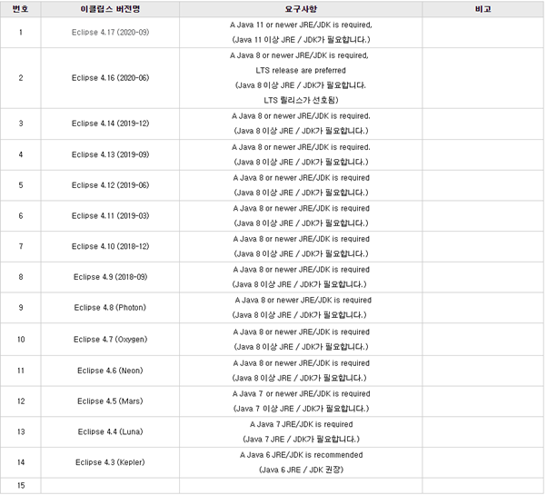
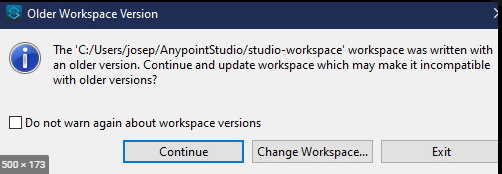
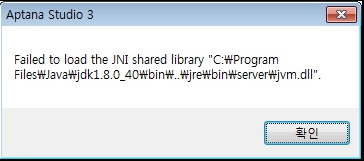
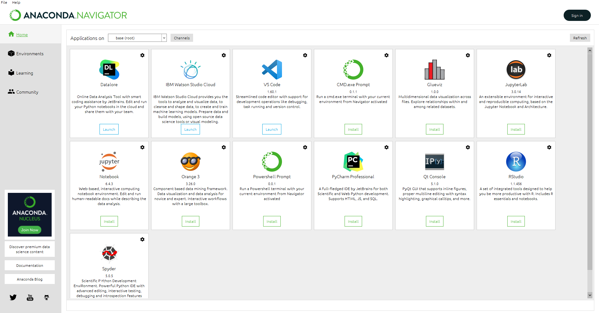

# Eclipse 버전별 JDK 지원표

포맷을 밥 먹듯이 하는 나에게 이번 포맷은 가장 힘들었던 시간이 아닐까 싶다.

IDE 와 언어들을 설치를 하며 무조건 최신 버전이 좋은거라고 생각하고 막 깔았지만 

난생처음 보지도 못한 에러를 마주하고 밤새 찾은 결과 자신이 공부하는 개발환경에 맞추어

설치를 해주지 않으면 보지 못하고 안되는것이 많은 에러가 발생을 하였다. 

1. 이클립스 프로젝트 오류

물론 실행하는데 있어서 전혀 문제는 없다. 

continue를 누르고 진행하면 되지만 닥쳐오는 불안감... 

예전 내가 썻던 4.16 버전을 설치하니 에러가 사라졌었다.

2. 앱타나 스튜디오 jdk 64bit 오류

aptana studio3은 32bit 환경에서 실행이 되는데 32bit java가 설치가 안되있고 인식을 못해서 생기는 오류 

3. anaconda 가 vscode를 인식못하는 오류

지금 위 사진은 오류가 해결되어 vs code가 잡혀있는 상태지만 오류가 난 이유 
직접 내가 해결한 방법이긴 하다 이게 맞는지는 정확한 조사가 필요하다
anaconda navigator은 현재 python 3.8까지 지원하는데 먼저  python 3.9부터 설치하고 vscode를 설치해서 그런가 anaconda navigator에서는 vscode가 인식이 안되는 오류가 생겼던거 같다. 

## 단순하다고 느낀 것이.

때로는 정말 어렵다고 느껴진다. 해결을 하는 맛은 있지만 해결을 하게 되면 조금만 더 생각해보고 검색해보고 설치를 해볼껄 이라는 아쉬움만 남게된다.
