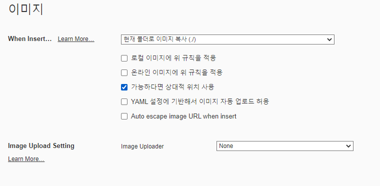
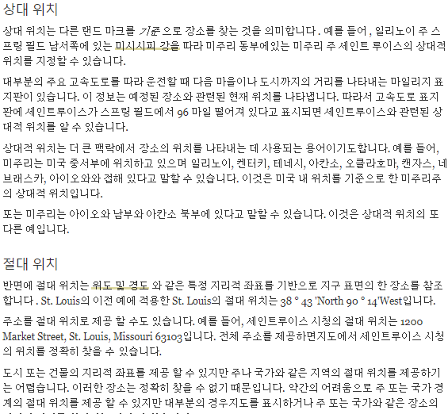
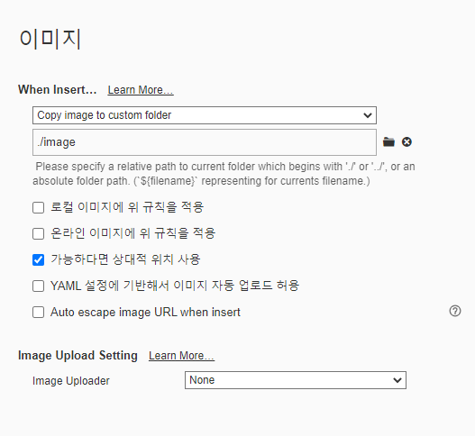

# 이미지가 잘 올라가는지 테스트

### 상대적 위치 설정

### 그렇다면?

다른 옵션들로 적용 시켜보자

### 온라인  이미지에 위 규칙을 적용 옵션

###  typora 이미지가 깃허브에 잘 인식이 되는가\image-20210917131258453.png)

### YAML 설정에 기반해서 이미지 자동 업로드 허용

 typora 이미지가 깃허브에 잘 인식이 되는가\image-20210917174644734.png)

YAML 이란?

YAML은 XML, C, 파이썬, 펄, RFC2822에서 정의된 e-mail 양식에서 개념을 얻어 만들어진 '사람이 쉽게 읽을 수 있는' 데이터 직렬화 양식

## Auto escape image URL when insert

%20typora%20%EC%9D%B4%EB%AF%B8%EC%A7%80%EA%B0%80%20%EA%B9%83%ED%97%88%EB%B8%8C%EC%97%90%20%EC%9E%98%20%EC%9D%B8%EC%8B%9D%EC%9D%B4%20%EB%90%98%EB%8A%94%EA%B0%80/image-20210917175144318.png)

##### 이미지를 조금더 깔끔히 업로드 하고싶다면?

이렇게 설정을 하게 되면 폴더경로에 저장이 되고 업로드했을시에 깔끔히 github.io에 출력이 된다. 

### 실험 결과 

typora 에서 작성한 마크다운 문서가 깃허브에서 제대로 인식이 될려면 상대적경로 이미지와 함께 push

