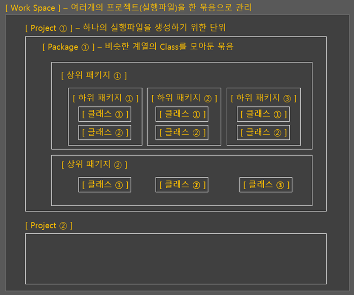
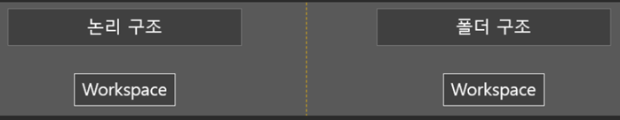
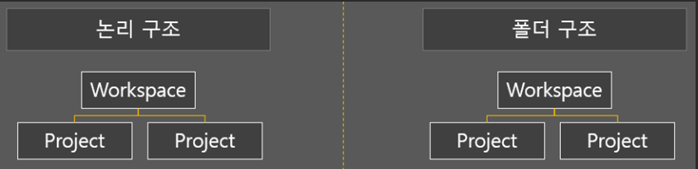
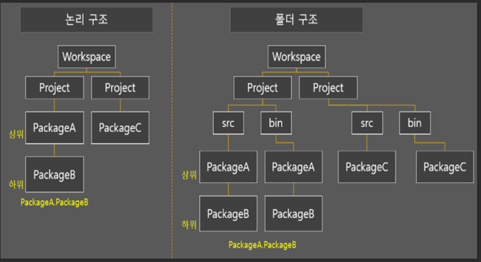
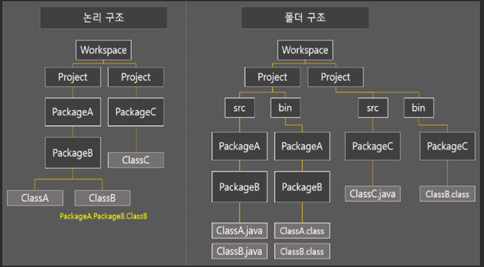
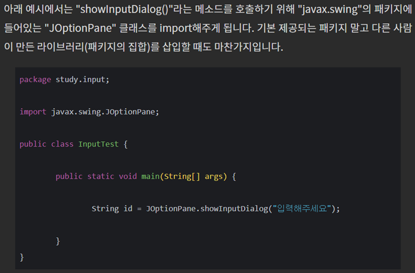
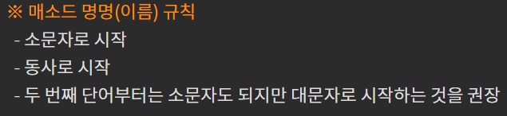

# 기초 개념 잡기

### Workspace

전체적인 구조 그림 -1 

 

실제 우리가 코딩을 하는 부분은 모두 Class  / 나머지는 분류를 위한 일종의 카테고리

 

##### ● 워크스페이스 ( WorkSpace )

하나의 프로그램 단위

규모가 큰(기능이 많은) 프로그램은 여러 실행파일(프로젝트)로 이루어질 수 있음

가장 상위 폴더로 생성됨.

★워크스페이스 명명(이름) 규칙

공통 규칙에 따름

  

### ● 프로젝트 (Project)

하나의 실행파일 단위

하나의 실행 파일을 생성하기 위한 단위라고 할 수 있음

워크스페이스의 하위 폴더로 생성됨

★ 프로젝트 명명(이름) 규칙

대소문자 구분 없이 시작 가능

첫 문자를 비롯해 모든 단어는 대문자로 시작하는 것을 권장

 

### ● 패키지(package)

클래스를 기능별로 묶어둔 일종의 카테고리

하나의 패키지만 만들 수도 있고 “상위 하위 패키지” 형태로 트리 구조를 만들 수 있음

상위 패키지 폴더 아래 하위 패키지 폴더가 생성됨

소스코드를 저장하는 “.java” 파일의 패키지는 프로젝트 폴더 아래 “src” 폴더에 저장됨

.java파일을 컴파일해서 생성된 “.class”파일의 패키지는 프로젝트 폴더 아래 “bin”폴더에 저장됨.

★ 패키지 명명 (이름) 규칙

단어 개수 상관없이 소문자로 시작

모두 소문자로 사용하는 것을 권장 ( 가족성을 위해서는 위반해도 됨 )

가급적 한 단어 사용을 권장 (상위 패키지 한단어, 하위 패키지 한단어씩)

여러 사람 또는 기업과 협업할 경우 표준 패턴을 따름 (개인용으로 쓸 때는 무의미)

표준패턴 : com.회사이름(또는 개인이름).프로젝트명. 상위패키지.하위패키지.클래스

### ● 클래스(Class)

비슷한 유형의 메소드(함수)와 변수를 모아놓은 소스코드

실제로 작성된 가장 하위의 소스코드 파일

이클립스 에디터에 작성하는 코딩을 하나의 클래스를 생성하는 작업임

클래스가 속한 마지막 패키지의 폴더에 저장됨

클래스의 파일명은 클래스의 이름과 동일해야 함

★ 클래스 명명(이름) 규칙

대문자로 시작

명사로 시작

두 번째 단어부터는 소문자도 되지만 대문자로 시작하는 것을 권장

### ● 메소드 (method)

클래스에 정의 되어 있는 함수

하나의 클래스에서 다른 클래스의 함수를 실행할 때 실제로 이 메소드를 실행하는 것

패키지A . 패키지B . 클래스C . (arguments)의 형태로 불러와서 실행

 

### ● 클래스 ( Class )

클래스란 ‘객체를 정의해 놓은 것’ 또는 ‘객체의 설계도 또는 틀’ 이라고 정의할 수 있다.

클래스는 객체를 생성하는데 사용되고 객체는 클래스에 정의된 대로 생성된다.

 

정의 : 객체를 정의해 놓은 것 

용도 : 객체를 생성하는데 사용

 

### ● 객체 ( Object )

사전적인 정의는 ‘실제로 존재하는 것’ 이다. 우리가 주변에서 볼 수 있는 책상,의자,자동차와 같은 사물들이 곧 객체다.

 

정의 : 실제로 존재하는 것, 사물 또는 개념

용도 : 객체가 가지고 있는 기능과 속성에 따라 다름

### ●인스턴스 ( instance )

클래스로부터 객체를 만드는 과정을 **클래스의 인스턴스화** 라고 하며, 어떤 클래스로부터 만들어진 객체를 그 클래스의 인스턴스라고 한다.

 

 

### ● 객체(Object) 의 구성요소

객체는 속성(Attribute)와 기능(방법, method), 두 종류의 구성요소로 이루어져 있으며, 일반적으로 객체는 다수의 속성과 기능을 가지고 있다.

속성 : 멤버변수,특성,필드,상태

기능 : 메서드, 행위, 함수

 

 

 

 

 

 

 

 

 

 