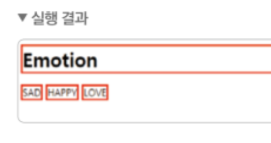
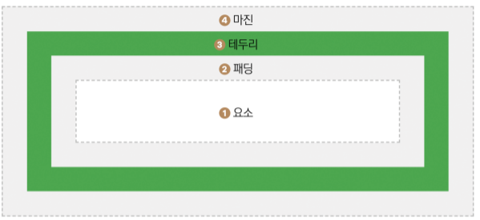

# Chapter 08 : CSS 배치 속성과 반응형 웹

### h1 태그와 span 태그에서 h1 태그는 줄바꿈이 되는데 span태그에서 줄바꿈이 되지 않는 이유는 ?

 h 태그가 **블록레벨 요소**이기 때문에 < span > 태그는 줄바꿈이 되지않는다.

### border 라는 속성  

요소에 테두리 굵기 스타일 색상 등을 지정할 수 있고 ★ 지정하는 값의 순서는 상관이 없다.

###  블록레벨요소

가로 줄 전체를 차지하는 요소

### 인라인 레벨 요소

요소 크기 만큼의 너비를 차지하는 요소 / 이해하기 쉬운 예 < span > 태그

이해하기 쉬운 예제 (위 이미지)

### 블록과 인라인의 개념의 존재 이유

보기 좋게 배치하기 위함

보기 좋게 배치하고 싶다면 태그마다 가지고 있는 특성이 중요

##### 박스모델 : 마진 , 테두리 , 패딩

padding ( 패딩 ) , border ( 태두리 ) , margin (margin)

요소 : 텍스트 사진등 보여줄 대상

패딩 : 요소 주변 영역을 감싸고있음 ( 해당부분은 투명 )

테두리 : 요소와 패딩을 감싸는 테두리

마진 : 테두리 밖의 영역을 감싸고 있음 ( 해당부분 투명 ) 

#### 쉽게 이해하는 방법

마진은 물건을 팔았을 때 남는 이익 / 따라서 요소,패딩,테두리를 표시하고 남은 영역이 마진

추울때 패딩을 입듯이  / 따라서 요소 위에 입는 것이 패딩 

