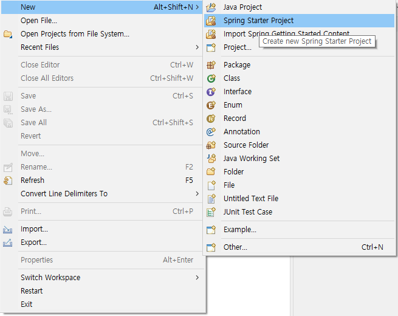
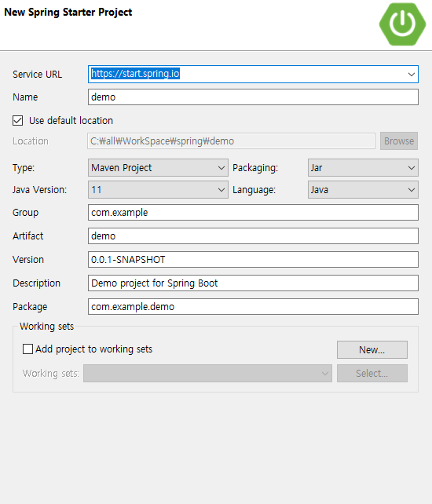
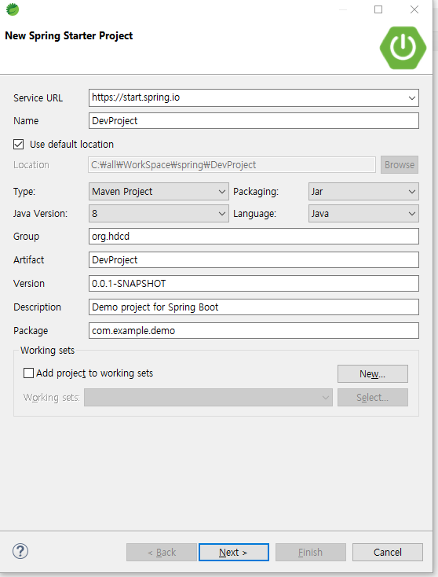
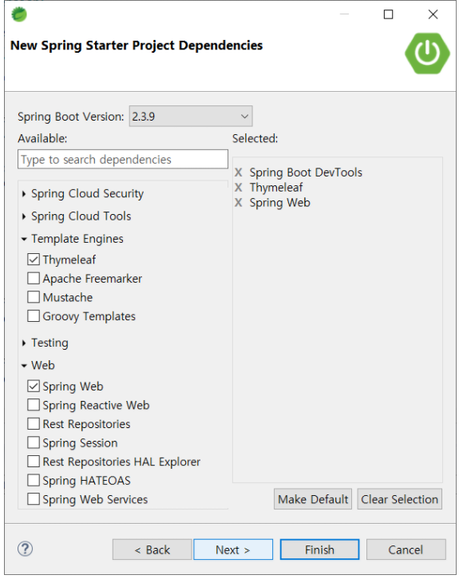
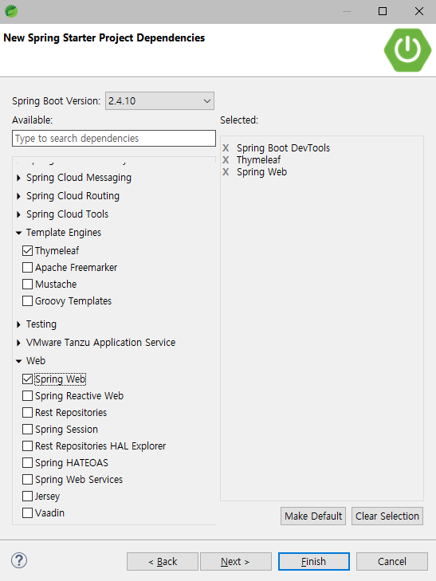
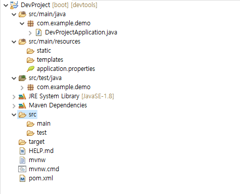
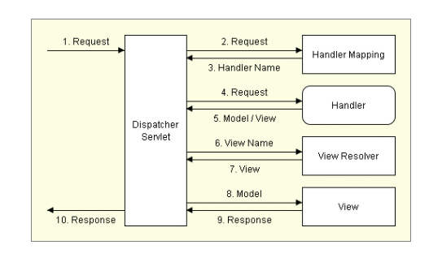

# Chapter02 : 프로젝트 생성

#### 

### 프로젝트 생성하기

file -> new -> spring starter project

### 설정 전 New Spring Starter Project

### 설정후

- 프로젝트 이름 변경
- Packaging 을 jar로 선택
- Group을 입력
- Package를 입력

### 스프링부트 버전 라이브러리 선택

위 이미지는 책에 있는 버전과 라이브러리 선택이였지만 본인은 교재와 다른 버전이긴 하지만 없는 라이브러리는 없어서 일단 진행을 하였다.

본인 설정 이미지

### 전반적인 프로젝트 파일 모습

구성하는데 Eclipse 와 달리 시간이 걸렸다. 
무엇인가 다운로드를 받고 세팅을 한다고 우측하단에 표시가 되어있엇다.

- pom.xml

메이븐 프로젝트 빌드 파일

- src / main / java

자바 소스 경로

- src / main / java / DevProjectApplication.java

애플리케이션을 시작할 수 있는 스프링 구성 메인 클래스 소스 파일

- src / main / resources

리소스 파일 경로

- src / main / resources / application.properties

애플리케이션에서 사용할 여러 가지 프로퍼티(Property) 정의

- src / main / resources / static

스타일 시트, 자바스크립트, 이미지 등의 정적 리소스 파일 경로

- src / main / resourse / templates

뷰 템플릿(Thymeleaf, Velocity 등) 파일 경로

### 스프링 MVC 요청 처리 흐름도

### 스프링 MVC 구조

스프링 MVC는 DispatcherServlet, View Resolver, Handler, View 등으로 구성

1. 클라이언트(브라우저)의 요청을 DispatcherServlet이 받는다.  
2. 받은 요청을 처리할 수 있는 Handler의 이름을 HandlerMapping에게 물어 본다.  
3. HandlerMapping은 요청 URL을 비롯한 여러 요청 정보를 가지고 Handler를 판단한다. 
4.  DispatcherServlet은 HandlerMapping으로 부터 선택받은 Handler에게 요청을 보낸다.  
5. Handler는 요청을 적절히 처리하고 응답에서 렌더링해야 하는 View Name을 판단해서 DispatcherServlet에 전송한다.  
6. DispatcherServlet은 논리적인 View Name을 View Resolver에 전달한다.  
7. View Resolver는 응답에 필요한 View를 생성하여 DispatcherServlet에 보낸다.  
8. DispatcherServlet은 해당하는 View에 Model을 전달한다.  
9. View는 Model을 참조해서 응답을 생성한다.  
10. DispatcherServlet는 생성된 응답을 클라이언트(브라우저)에 반환한다.

### 의존성을 추가 한다?

사전상 의미로는 (비정상적이거나, 불필요할 정도)의 의존,종속을 뜻함

프로그래밍 관점으로는 하나의 클래스가 다른 하나의 클래스에 의존하는 것

### 의존성의 단점

- 의존성 주입을 위한 선행작업이 필요함.
- **코드를 추적하고 읽기가 어려워짐.**

### 마무리 

간단한 세팅에 미치는 수준이지만 

그 세팅이 정작 무엇을 하는지 어떻게 동작을 해야되고 왜 필요한지 알아보는 과정이 시간이 너무 걸렸다.

계속 찾아보는 이유도 적어도 내가 쓰는 것이 뭘하는지 왜 해야되는건지는 알아야지 예제를 그리고 설명을 보는데 더 보기 쉽지 않을까 싶었기 때문이다.