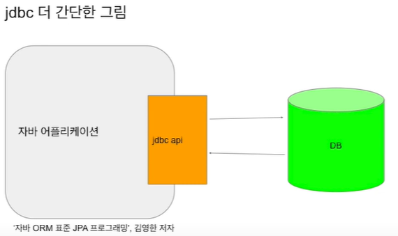
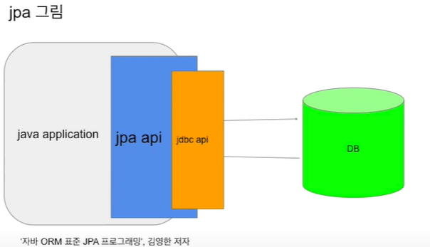

# JPA 와 JDBC

##### 참고자료

- https://www.youtube.com/watch?v=Ppqc3qN75EE&list=PLgXGHBqgT2TvpJ_p9L_yZKPifgdBOzdVH&index=155 ( 우아한 Tech / 테코톡 (🙆‍♂️올레의 JPA와 JDBC)

- https://lipcoder.tistory.com/entry/JDBC-%EA%B0%9C%EB%85%90%EC%A0%95%EB%A6%AC (입코딩 블로그)

- https://velog.io/@modsiw/JPAJava-Persistence-API%EC%9D%98-%EA%B0%9C%EB%85%90 (래지 블로그)

  

### JDBC (java DataBase Connectivity) 특징

1. sql 문
2. connection 관리
3. preparedstatement,, resultset 객체

connection 객체가 db와 app의 연결을 관리하고, preparedstatement가 sql을 전달하며,

resultset 객체를 통해 결과값을 전달한다.

### JDBC 구성

- 응용프로그램
  - 데이터베이스에 연결을 요청
  - 데이터베이스에 SQL 문을 전송
  - SQL 문의 처리 결과 요청
  - 오류가 발생하는 경우에 오류 처리
  - 트랜잭션을 제어
  - 연결 종료
- 드라이버 매니저
  - 데이터 베이스에 맞는 드라이버 검색
  - JDBC 초기화를 위한 작업 수행
- 드라이버
  - 데이터베이스에 연결
  - 데이터베이스에 SQL문을 전달
  - 응용 프로그램에 검색 결과 전달
  - 필요한 경우 커서를 조작
  - 필요한 경우 트랜잭션을 시작
- DBMS
  - 데이터가 저장되어 있는 장소

### JDBC을 그림으로 (간단하게)

### JPA를(을) 그림으로 (간단하게)

### JPA(Java Persistence API)

- 자바 ORM 기술에 대한 표준 명세로, JAVA에서 제공하는 API이다. 스프링에서 제공하는것이 아님

- 자바 어플리케이션에서 관계형 데이터베이스를 사용하는 방식을 정의한 인터페이스
- 중요한건 JPA는 말 그대로 인터페이스
  JPA는 특정 기능을 하는 라이브러리가 아니다. 스프링의 PSA에 의해서(POJO를 사용하면서 특정 기술을 사용하기 위해서)표준 인터페이스를 정해두었는데, 그중 ORM을 사용하기 위해 만든 인터페이스가 바로 JPA

### JPA 를 사용해야 하는 이유

1. sql 중심적인 개발에서 객체 중심적인 개발이 가능 ( sql 코드 반복 , 객체지향과 관계지향 데이터 베이스의 패러다임 불일치)
2. 생산성 증가 (간단한 메소드로 CRUD가 가능)
3. 유지보수 용이 
   - 기존 : 변경시 모든 SQL 수정
   - JPA : 필드만 추가하면 됨 (SQL 은 JPA가 처리하기 때문에 손댈 것이 없음)

### 용어 정리

- ORM : 객체와 DB의 테이블이 매핑을 이루는 것
  객체가 테이블이 되도록 매핑 시켜주는 것

