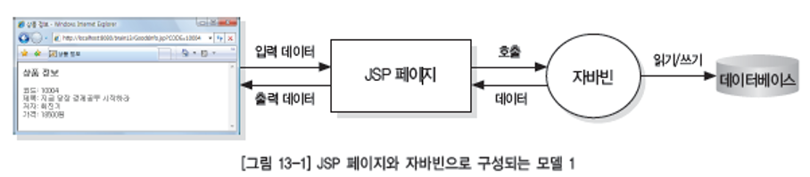
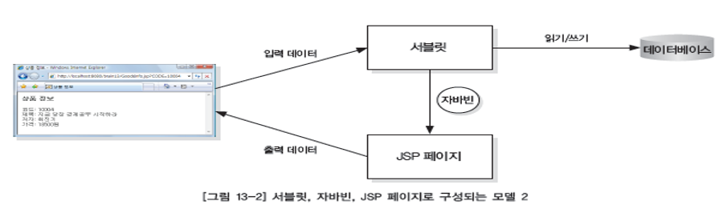
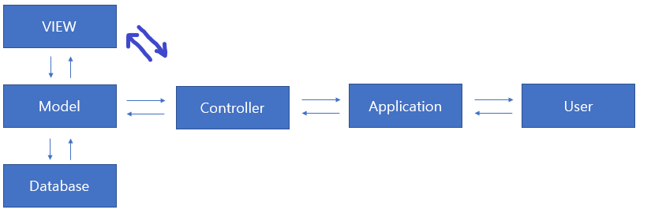

# MVC 패턴

### 참고자료

https://www.youtube.com/watch?v=uoVNJkyXX0I

### MVC 패턴이란?

Model & view &  Controller

애플리케이션을 3가지 역할로 구분한 개발방법론

### 웹 어플리케이션의 아키텍쳐 : Model 1 (모델 1)

- 구성 : JSP + javaBean(Service)

- 뷰와 로직이 섞인다.

##### 장점

1. 구조가 단순

##### 단점

1. 출력과 로직 코드가 섞여 JSP 코드가 복잡해진다.
2. 프런트와 백엔드가 혼재되어 분업이 용이하지 않다.
3. 유지보수가 어렵다.

### 웹 어플리케이션 아키텍쳐 : Model (모델 2) = MVC

- Model 1의 단점 때문에 Model 2 가 탄생

- 구성 : JavaBean(Service) + JSP + 서블릿 (Controller)

- MVC 구조

  

##### 장점

1. 뷰와 로직의 분리로 모델 1에 비해 덜 복잡
2. 분업이 용이
3. 유지보수가 쉽다.

##### 단점

1. 모델 1에 비해 습득이 어렵다
2. 작업량이 많다.

### MVC 흐름

1. 사용자는 원하는 기능을 처리하기 위한 모든 요청을 컨트롤러에 보낸다.
2. 컨트롤러는 모델을 사용하고, 모델은 알맞은 비즈니스 로직을 수행한다.
3. 컨트롤러는 사용자에게 보여줄 뷰를 선택한다.
4. 선택된 뷰는 사용자에게 알맞는 결과 화면을 보여준다.

### MVC

원래 개인용 컴퓨터에서 작동하는 애플리케이션의 개발을 목적으로 만들어진 패턴

WWW ( World Wide WEB ) 애플리케이션을 사용하기 위한 용도로도 폭넓게 사용되고 있음