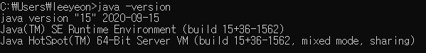
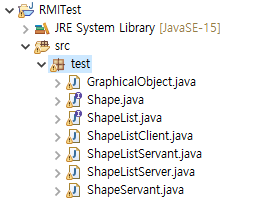
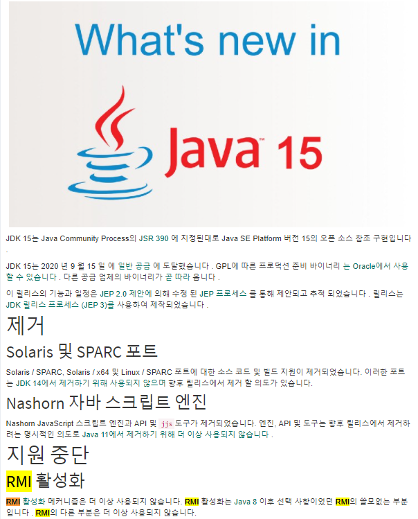
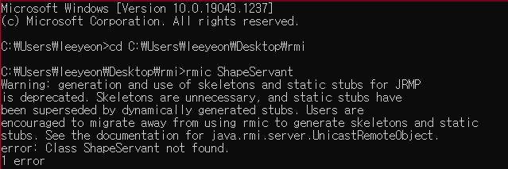
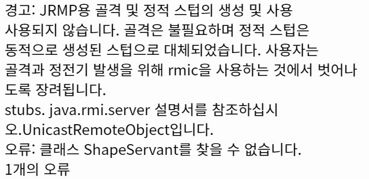

# RMI 구현

### 환경세팅


Java 15 (version)



Eclipse (2021-09 ver)


Eclipse project setting ( javaSE-15 ver )



------


### 구현과정

1. ##### 인터페이스


- ShapeList.java

```java
package test;

//인터페이스 선언
import java.rmi.*;
import java.util.Vector;

//Vector->배열과 같이 객체 저장가능 클래스
public interface ShapeList extends Remote {
	//method 선언
	Shape newShape(GraphicalObject g) throws RemoteException;  	    
	Vector allShapes() throws RemoteException;
	int getVersion() throws RemoteException;
	//메소드 추가 후 ShapeListServant에서 해당 메소드 구현
	String test() throws RemoteException;
	}
```

- Shape.java

```java
package test;

import java.rmi.*;
import java.util.Vector;

public interface Shape extends Remote {
	int getVersion() throws RemoteException;
	GraphicalObject getAllState() throws RemoteException;
	}
```


2. ##### 원격 인터페이스와 서버


- ShapeListServer.java

```java
package test;

import java.rmi.*;
import java.rmi.server.UnicastRemoteObject;

public class ShapeListServer {
	public static void main(String args[]){
		System.setSecurityManager(new SecurityManager());
		System.out.println("Main OK");
        	try{ShapeList aShapelist = new ShapeListServant();
            System.out.println("After create");
            Naming.rebind("ShapeList", aShapelist);
            System.out.println("ShapeList server ready");
            }catch(Exception e) {
            	System.out.println("ShapeList server main " + 
        				e.getMessage());   } 
   }
}
```

- ShapeListServant.java

```java
package test;

import java.rmi.*;
import java.rmi.server.UnicastRemoteObject;
import java.util.Vector;

public class ShapeListServant extends UnicastRemoteObject implements ShapeList{
	private Vector theList;
	private int version;
	public ShapeListServant()throws RemoteException{
		theList = new Vector();
		version = 0;}
	public Shape newShape(GraphicalObject g)
			throws RemoteException{
		version++;
		Shape s = new ShapeServant(g, version);
		theList.addElement(s);                
		return s;     }
	public  Vector allShapes()throws RemoteException{
		return theList;    }
	public int getVersion() throws RemoteException{
		return version;    }
	//추가 메소드
	public String test() throws RemoteException {
		String str = "String Transfer Test";
		return str; 
		} 
	}
```

- ShapeServant.java

```java
package test;

import java.rmi.*;
import java.rmi.server.UnicastRemoteObject;

public class ShapeServant extends UnicastRemoteObject implements Shape {
	int myVersion;
	GraphicalObject theG;
	public ShapeServant(GraphicalObject g, int version)throws RemoteException{
		theG = g;
		myVersion = version;
		}
	public int getVersion() throws RemoteException {
		return myVersion;
		}
	public GraphicalObject  getAllState() throws RemoteException{
		return theG;
		}
	}
```


3. ##### 원격 인터페이스를 사용하는 클라이언트

- GraphicalObject.java

```java
package test;

import java.awt.Rectangle;
import java.awt.Color;
import java.io.Serializable;	//Serializable->동시사용자를 위한 직렬화

public class GraphicalObject implements Serializable{
	public String type;
	public Rectangle enclosing;
    public Color line;
    public Color fill;
	public boolean isFilled;
	public GraphicalObject() { }
	public GraphicalObject(String aType, Rectangle anEnclosing, Color aLine,Color aFill, boolean anIsFilled) {
		type = aType;
		enclosing = anEnclosing;
		line = aLine;
		fill = aFill;
		isFilled = anIsFilled;
		}
	public void print(){
		System.out.println("도형 : "+type);
		System.out.print("속성 : "+enclosing.x + " , " + enclosing.y 
				+ " , " + enclosing.width + " , "  + enclosing.height);
		if(isFilled)
			System.out.println("- filled");
		else 
			System.out.println("not filled");
		}
	}
```

- ShapeListClient.java

```java
package test;

import java.rmi.*;
import java.rmi.server.*;
import java.util.Vector;
import java.awt.Rectangle;
import java.awt.Color;

public class ShapeListClient{
	public static void main(String args[]){
		String option = "Read";
		String shapeType = "Rectangle";
		if(args.length > 0) option = args[0];	// read or write
		if(args.length > 1) shapeType = args[1]; // specify Circle, Line etc
		System.out.println("option = " + option + "shape = " + shapeType);
		if(System.getSecurityManager() == null){
			System.setSecurityManager(new SecurityManager());
			} else System.out.println("Already has a security manager, so cant set RMI SM");
		ShapeList aShapeList = null;
		try{aShapeList =
				(ShapeList)Naming.lookup("rmi://210.112.129.39/ShapeList");
		System.out.println("Found server");
		Vector sList = aShapeList.allShapes();
		int ver = aShapeList.getVersion();
		String str = aShapeList.test();
		System.out.println("Got vector");
		if(option.equals("Read")){
			for(int i=0; i<sList.size(); i++){
				GraphicalObject g =
						((Shape)sList.elementAt(i)).getAllState();
				g.print();  }
			} else {
				GraphicalObject g = new GraphicalObject(shapeType, new Rectangle(50,50,300,400),Color.red,Color.blue, false);
	            System.out.println("Created graphical object");
	            aShapeList.newShape(g);
	            System.out.println("Stored shape");
	            }
		System.out.println("Version : "+ver);
		System.out.println(str);
		}catch(RemoteException e) {
			System.out.println("allShapes: " + e.getMessage());
			}catch(Exception e) {
				System.out.println("Lookup: " + e.getMessage());
				}
		}
	}
```


------


### 이게 맞는가?




### JDK 1.8로 시도





ShapeServant를 찾을 수 없다고 한다. 뭐가 문제일까?


### 결론

코드에서 오류를 찾을 생각을 안하고 단순히 버전이 안맞아서 다른 버전으로 시도할 생각을 하지 못했다.

내가 해결한 것은 아니지만 결론을 말하자면

java 14 버전 까지 rmi 코드를 실행하면 이상없이 동작을 하지만 (코드를 수정하면)15 버전부터는 rmi 스텁을 정적으로 생성을 해줄 필요가 없다는 것 동적으로 자동적으로 생성한다는 결과가 나오게 되었다.


