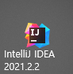
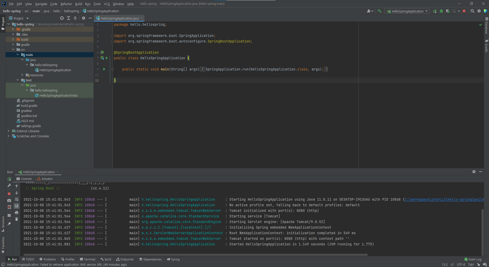
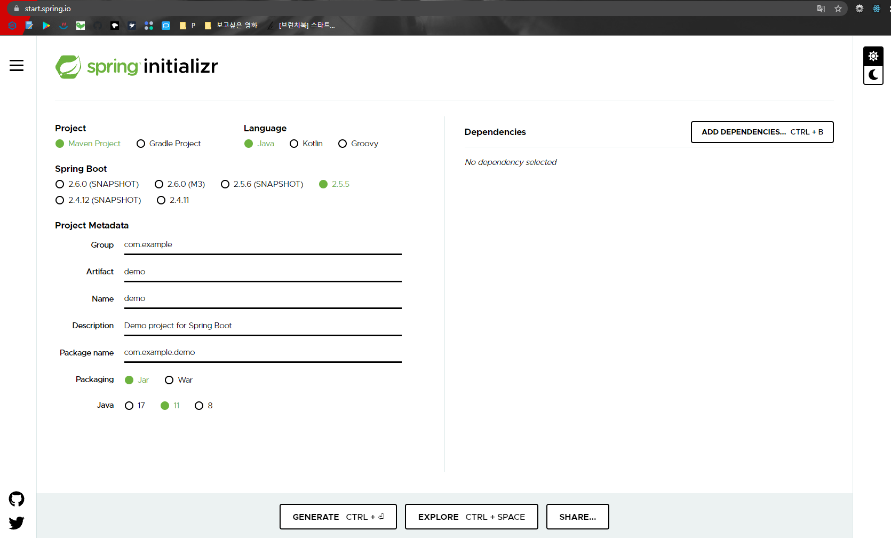
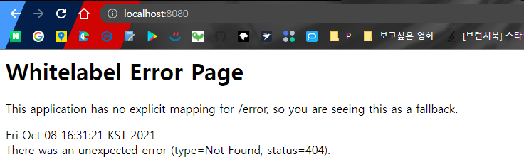
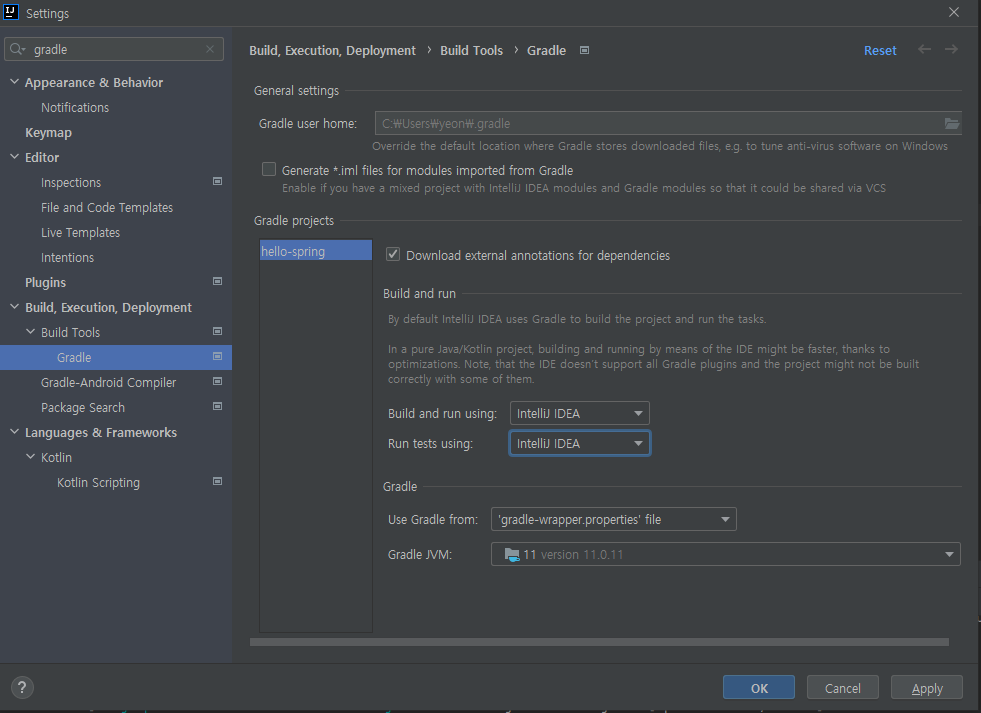

# Spring boot

### 참조 자료

https://goddaehee.tistory.com/238 ( 갓대희의 작은공간 - [스프링부트 (1)] 스프링부트 시작하기 (SpringBoot 프로젝트 설정 방법)

https://brunch.co.kr/@springboot/530 (브런치 - 스프링부트 백엔드 프로그래밍)

https://limdevbasic.tistory.com/11 (hello my world! - [Spring Boot] Spring Boot란? Spring Boot의 특징과 장점)

https://www.inflearn.com/course/%EC%8A%A4%ED%94%84%EB%A7%81-%EC%9E%85%EB%AC%B8-%EC%8A%A4%ED%94%84%EB%A7%81%EB%B6%80%ED%8A%B8/dashboard

( 인프런 - 김영한 (**스프링 입문 - 코드로 배우는 스프링 부트, 웹 MVC, DB 접근 기술**))

### 스프링 부트

- 스프링 프레임워크를 사용하는 프로젝트를 아주 간편하게 설정할 수 있는 스프링 프레임워크의 **서브 프로젝트**라고 할 수 있다고 함

- 상용화 가능한 수준의 스프링 기반의 애플리케이션을 쉽게 만들 수 있게 해준다고 함.

### 스프링 부트를 사용하는 이유와 장점

- 스프링 프레임워크의 장점을 그대로 보존하며 개발자가 비즈니스 로직에 집중하여 생산성을 높이게 해줌
- 단독 실행이 가능하다.
- 만들기 쉽다.

### IDE 

intelliJ ultimate (학생 라이센스) 를 사용하였다.

### start.spring.io

spring boot project를 생성해주는 사이트라고 한다. 

자신이 어떤 프로젝트 어떤 언어 스프링부트 프로젝트 등 설정을 하여 제네레이트를 해주면 생성되 압축파일로 생성이 된다.

프로젝트를 생성하여 자신이 사용하는 IDE에 임포트를 시켜 실행을 해보았다. 

### 스프링 부트 프로젝트 실행하기

가동을 하여 나온 페이지 이다. 

" localhost:8080 " 을 크롬 창에 입력하면 나오는데 정상적으로 실행된 화면이라고 한다.

아무것도 없기 때문에 에러페이지가 나온다고 한다.

### 그래들을 통해서 실행될 때 해결방법

이렇게 설정을 해주게 된다면 그래들을 통하지 않고 실행이 되기 때문에 조금 더 빠른 실행이 가능하다고 한다.

