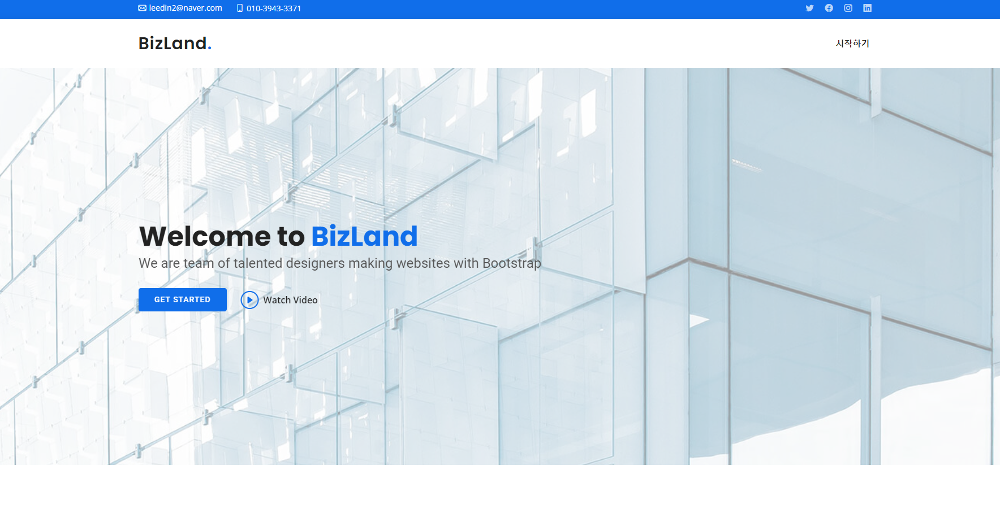
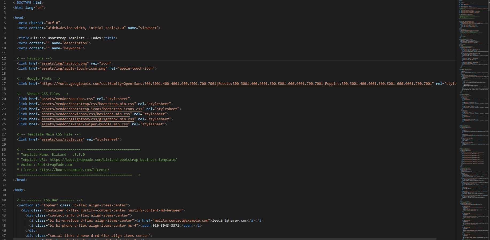
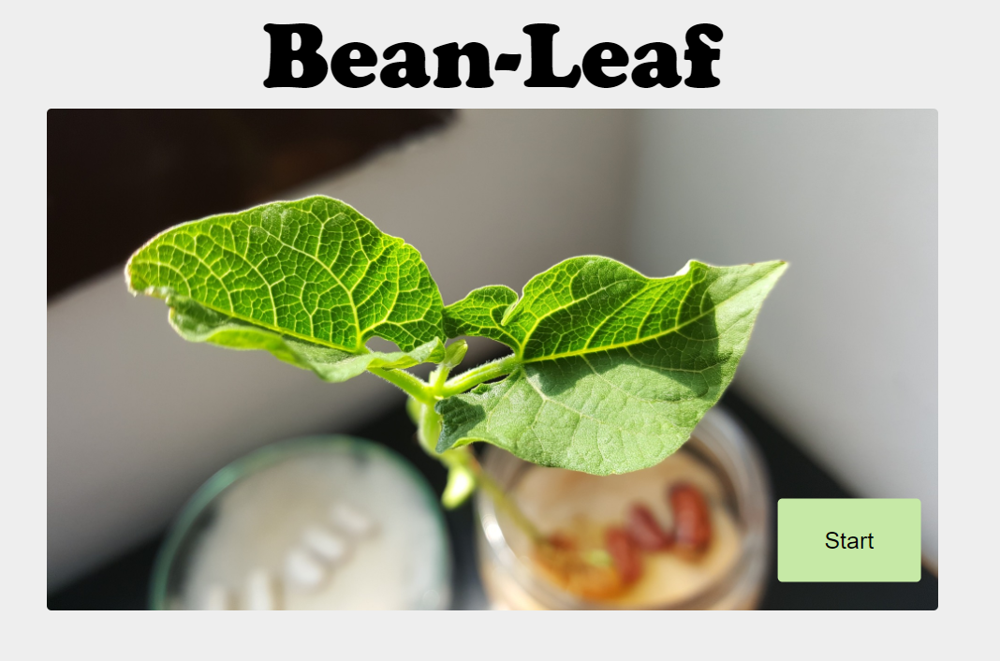
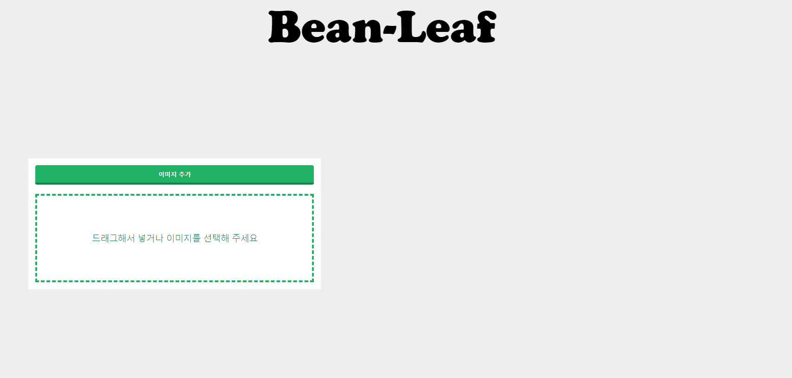

# 부트스트랩을 이용한 웹 메인페이지 구축하기

### 

부트스트랩 템플릿을 구하여 종합설계 때 발표할 자료를 담을 웹사이트 메인페이지 제작을 공부하였다. 

일단은 저렇게 많은 태그들 속에서 내 입맛에 맞게 수정하기에는 시간이 너무 걸리게 될꺼같았다는 느낌이 들었다.

조금은 부족하더라도 메인페이지 레이아웃을 직접 짜보는게 더 나을꺼 같다는 생각을 하였지만 일단 시작을 하였기에 내가 직접 만들어도 보고 

지금 받은 웹페이지를 내 입맛에 고치는것도 경험이라 생각되었기 때문이다. 

추후 여기에 진행결과를 README 파일에 올려볼 것이다.

### 위 템플릿을 이용하여 제작을 할려 했으나...

많이 필요가 없었다.

구현을 하고 보여줄 부분이 많지가 않아 새로 페이지를 구성하였다.

##### 메인 페이지

##### 뷰 페이지

