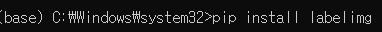
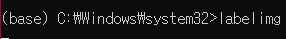
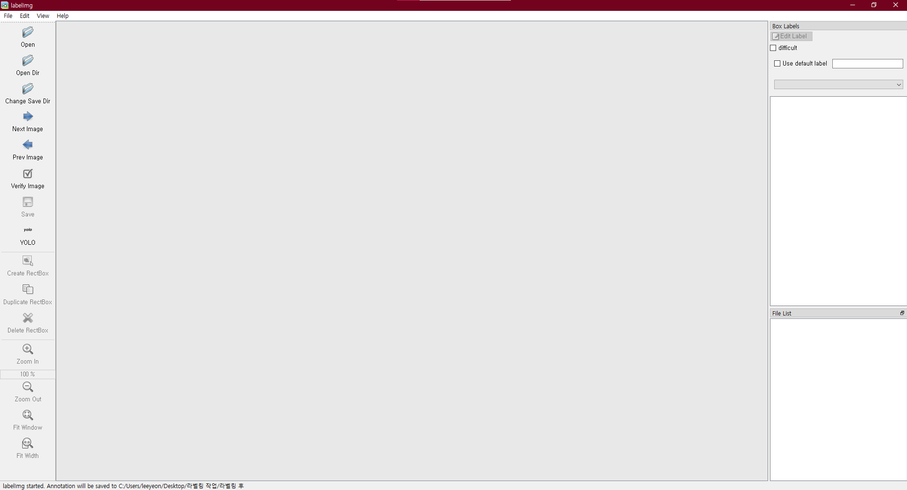
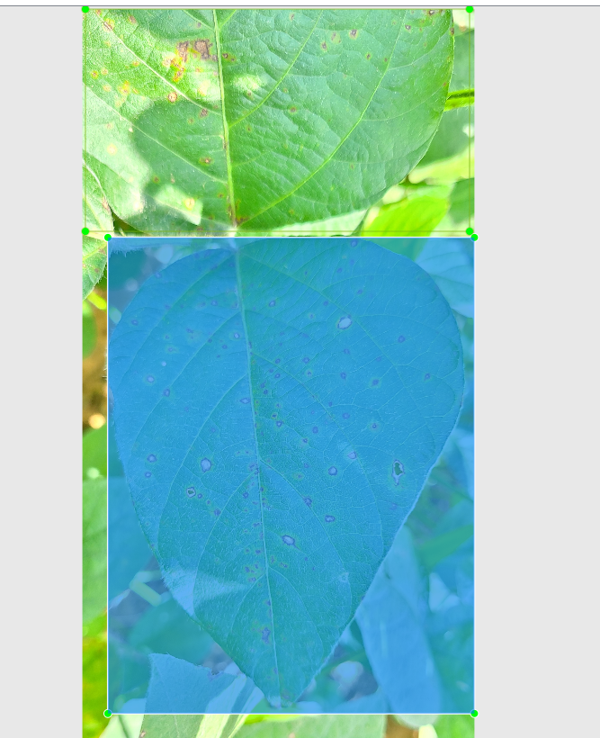
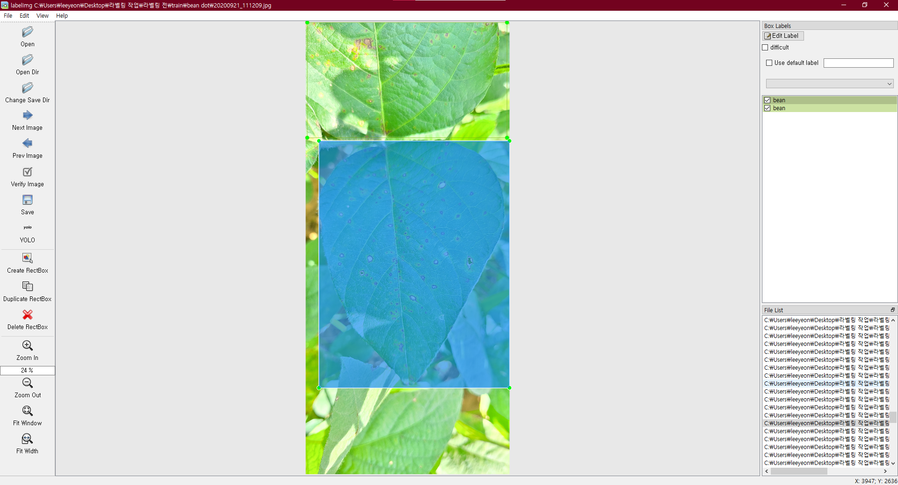

# 라벨링 작업

### 설치 및 실행

1. 

Anaconda Prompt 로 pip 를 이용하여 labelimg를 설치한다.

2. 

labelimg 를 입력하여 labelimg를 실행한다.

### 라벨링 작업

labelimg 를 이용하여 라벨링 작업을 한다.

### 

### 데이터 라벨링이란?

데이터 라벨링이란 이미지, 영상, 텍스트 등의 데이터에 사람이 데이터 가공 도구를 활용하여 인공지능이 학습할 수 있도록 다양한 정보를 목적에 맞게 입력하는 것을 의미

### 결과

200장의 이미지를 라벨링을 해보았다

라벨링을 하면서 반복작업이긴 하지만 여러가지 생각이 들었다.

데이터 라벨링을 함으로 인공지능이 더 정확하게 학습을 할 수 있게해주는 단계지만

생각보다 너무 반복적이라 피로감이 쉽게 몰려오는거 같았다.

