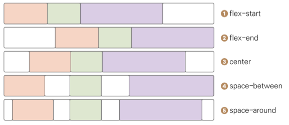

# Chapter09 : CSS 레이아웃 플렉스 박스


### 플렉스 박스

옛날에는 레이아웃을 구성을 한다고 했을 때 화면 크기가 다양하지 않았기 때문에 인라인/블록 레벨 요소로 다 구성이 가능 하였지만 

지금은 다양한 레이아웃을 만들고자 고안된 기법이 플렉스 박스(flexbox)이다.

플렉스는 " 유연한 " 이라는 뜻을 가지고 있고 이름만큼이나 화면 레이아웃을 유연하고 자유자제로 배치할 수 있게 해준다.

플렉스 박스는 사용자 인터페이스 디자인에 최적화된 레이아웃을 정의하는 CSS


### display 속성

기본적으로

```html
<style>
	속성적용을 원하는태그 {
		display: flex;
	}
</style>
```

이렇게 flex를 정의할수 있다

### justify-content 

별도의 설정이 없다면 

기본축 : 가로 / 교차축 : 세로

```
<style>
	속성적용을 원하는태그 {
		display: flex;
		justify-content: flex-start;
	}
</style>
```


- flex-start : 시작 부분 정렬
- flex-end : 끝에 정렬
- center : 중앙에 정렬
- space-between : 요소가 축을 따라 펼쳐짐 ( 각 요소사이에 공간 있음 )
- space-around : 요소가 축을 따라 펼쳐지지만 가장자리 주변에도 공간이 있음

justify-content 속성별 배치 스타일을 보고 이해하면 편할듯 하다.




- ### 요약

공간 맞추기 : display:flex

주축 정렬하기 : justify-content

교차축 정렬하기 : align-items

