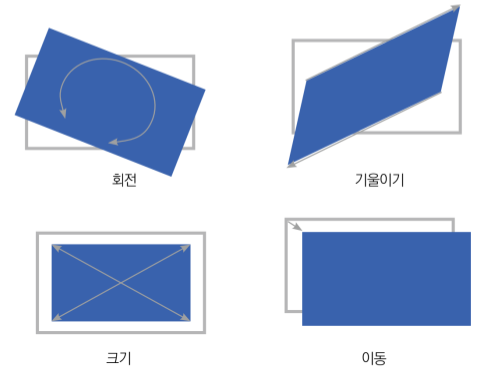

# Chapter12 : CSS 애니메이션 만들기


### CSS 에서 애니메이션 이란?

움직이는(변화하는) 효과를 의미 

예 ) 글자색, 이미지위치에 변화


### 전환

시간에 따른 상태를 지정하는 애니메이션

- 장점

  형태의 변형을 부드럽게 만들어주는 점


### 전환의 필수 속성 / 선택 속성

- 필수 속성

  전환 속성값

  전환시간

- 선택 속성

  전환 타이밍

  전환 지연


### 전환 속성값 ( Transtion-property )

전환될 속성을 지정

border-color와 같은 개별 속성 또는 all(전체 속성)이 있다.

전체를 지정하면 모든 속성에 개별 속성을 지정하면 지정한 개별 속성에 애니메이션이 적용

```html
<style>
	transition-property: border-color;	/* 개별 속성 */
    transition-property: all;			/* 전체 속성 */
</style>
```

```html
<style>
	transition-timing-function: ease-in;	/* 전환 타이밍 : 전환이 이루어지는 시점을 지정 */
    	/* 
    	속성값 : linear , ease-in , ease-out, ease-in-out, step-start, step-end 등
        ease = 기본값
        linear는 일정하게 전환
        ease-in은 느려졌다 빨라짐
   		 */
</style>
```

```html
<style>
    element {
        transition-delay: 1s;
    }
        /*
    		전환 지연 (transition-delay)
    		전환을 지연시켜 전환이 시작되는 시기를 지정
    		기본적으로 전환은 조건이 충족되는 즉시 실행
        */
</style>
```


### 변형

변형 (transform) CSS 속성을 사용하면 외적인 형태의 변형을 줄 수 있다.
회전 (rotate) , 기울이기(skew) , 크기(scale) , 이동(translate) 가 있음




