# Chapter 1 : 스프링 부트 개발 환경

## 학습 목표

설치 및 환경설정이 중요하다고 생각해 이번에는 간추리지않고 그대로 내가 설정한 그대로 
기입을 하였다. 

### 1. 자바 설치 

1. oracle 홈페이지에 들어가 / 제품 -> Java 

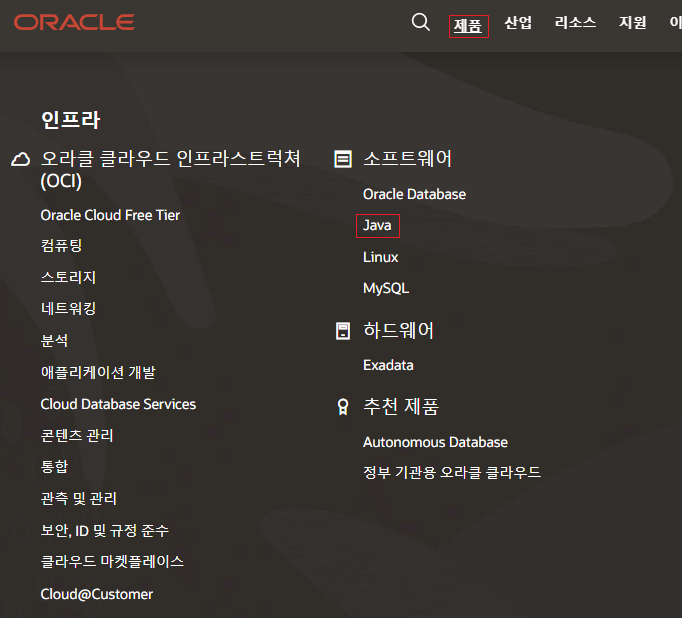

2. 스크롤 내린다음 /  java se -> Java 다운로드 

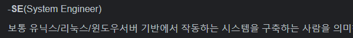

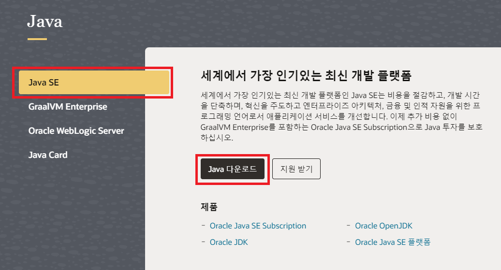

3. java archive 에 들어가 본인이 설치하고자 하는 JDK 버전 설치

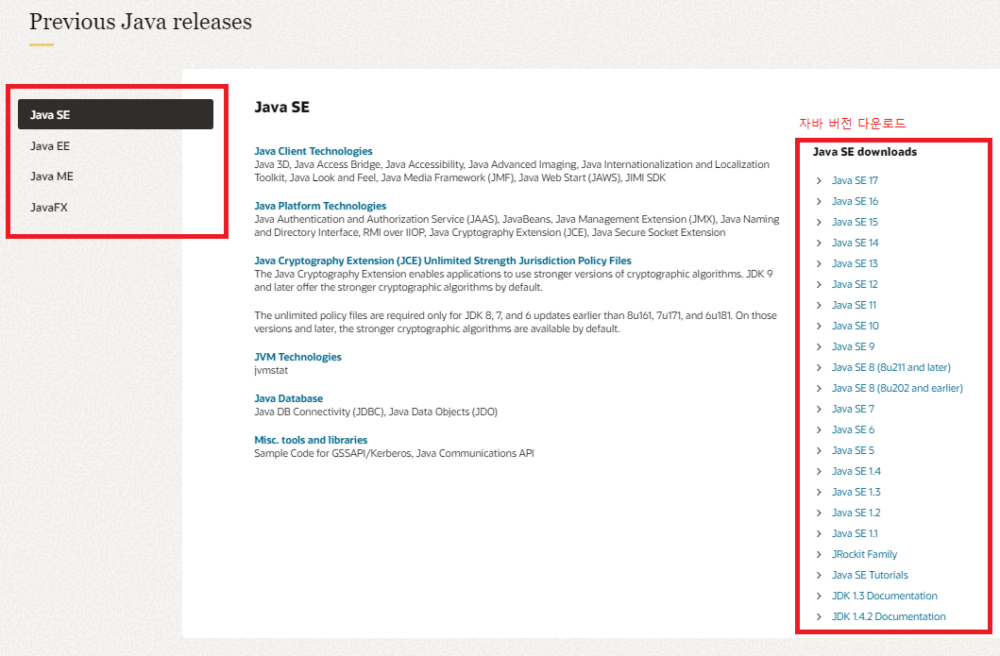

- Java SE , EE , ME , FX 차이 (참조 : https://shs2810.tistory.com/2)

Java SE ( Standard Edition )

대부분 사람들이 Java 프로그래밍 언어를 생각할 때 생각하는 플랫폼 Java SE의 API는 Java 프로그래밍의 핵심 기능 제공

Java EE ( Enterprise Edition )

커뮤니티 중심의 에디션 Java SE 플랫폼 위에 구축이 됨

대규모의 다 계층, 확장성, 안정성 및 네트워크 애플리케이션을 개발 및 실행하기 위한 API
및 런타임을 제공

HTML, CSS, Javascript 등을 사용하여 웹 페잊와 서비스를 생성하는 가장 널리 사용되는 웹 개발 표준 중 하나

데스크톱뿐만 아니라 웹 개발, 네트워크 및 고급 기능에 사용

Java ME (Micro Edition)

임베디드 시스템, 모바일 기기 등에서 Java 프로그래밍 언어 응용 프로그램을 실행하기 위한 API가 포함된 플랫폼

휴대전화, 무선기기, 셋톱박스에서 작업하는 것이 기본 목표

API는 Java SE API의 부분 집합, 모바일 기기에서 개발하기 위한 특수 라이브러리를 가진다.
하지만 현재는 사용하는 스마트폰에는 자체 OS를 가지고 있고 자체 API를 사용하기 때문에 거의 사용하지 않는다고 함

Java FX

간단한 사용자 인터페이스 API를 사용하여 응용 프로그램을 작성하기 위한 플랫폼

★ Java SE는 java EE가 구축되는 기본이고 Java ME는 SE의 하위 집합

## 2. Spring Tools 설치

##### 책이랑 다르게 접근을 했다.결국 spring tools 라고 치면 나오기는 하지만 spring 사이트와 똑같은 주소에 다른 페이지가 있길래 스프링 홈페이지에서 찾아보니  이렇게도 들어갈 수 있었다.

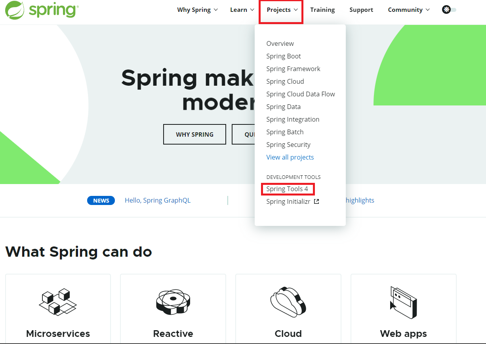

##### 버전은 어느것을 사용하라는 지정이 없어서 다운로드 메인에 있던 최신 버전을 사용하였다.

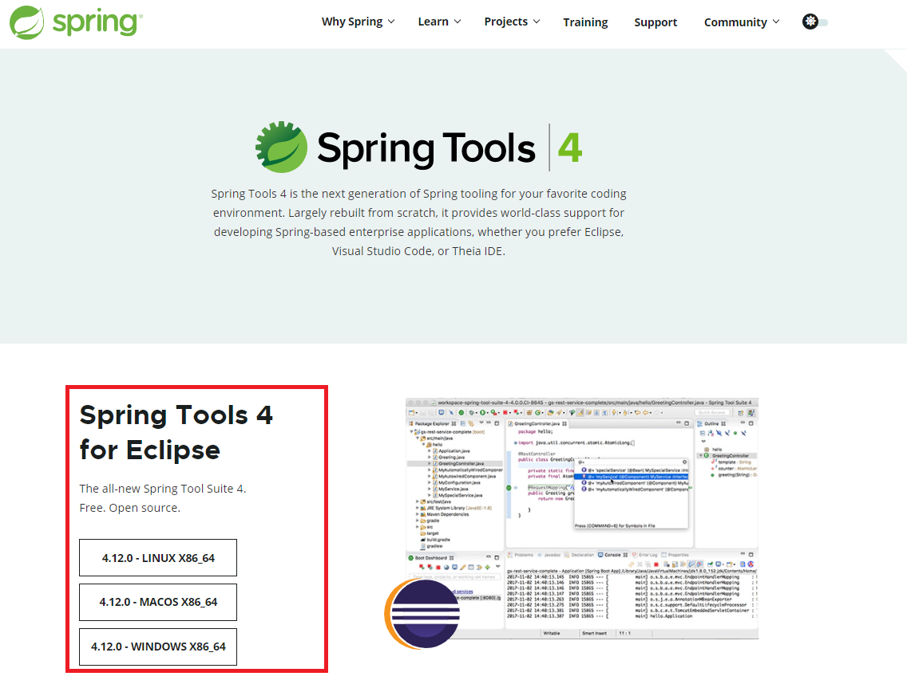

##### Jar 파일 열기

cmd를 이용하여 java -jar "경로및 파일이름"으로 설치를 해보았다.

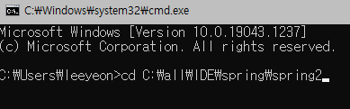

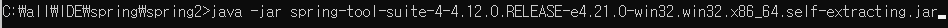

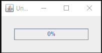

##### Spring Tool 설정

workspace 경로 지정후 실행을 하였다.

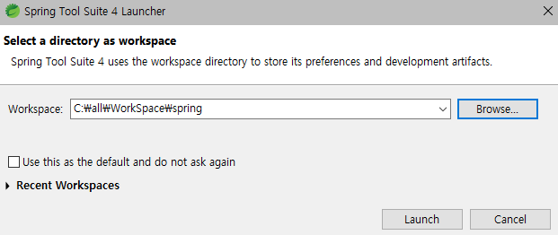

##### UTF-8 설정

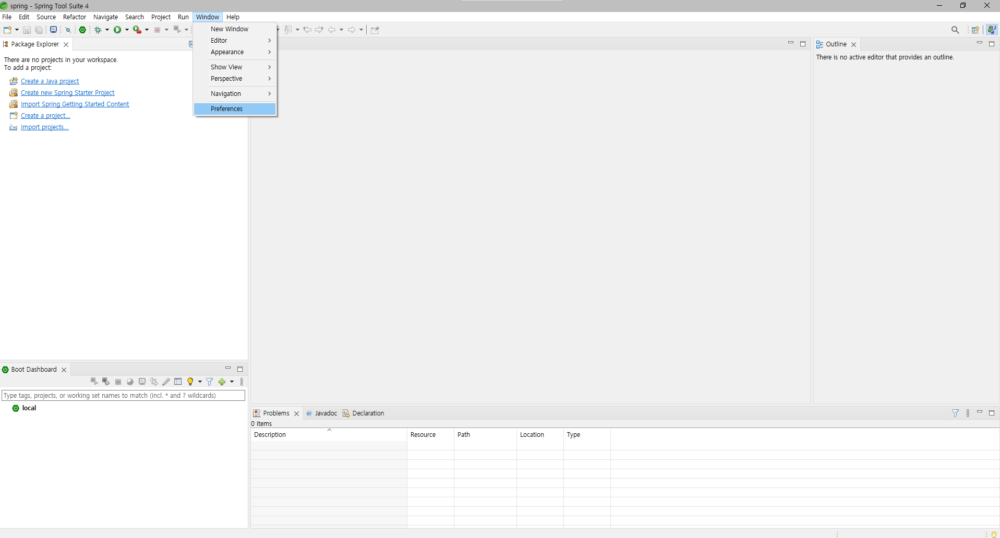

이 설정은 아마 웹을 다루는 사람들에게 가장 중요하다고 생각이 된다.

UTF-8은 유니코드를 인코딩을 하는 방식이다 전세계에서 사용하는 약속이기 때문이다.

참조 : https://jeongdowon.medium.com/unicode%EC%99%80-utf-8-%EA%B0%84%EB%8B%A8%ED%9E%88-%EC%9D%B4%ED%95%B4%ED%95%98%EA%B8%B0-b6aa3f7edf96

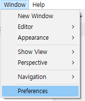

window -> Preference 

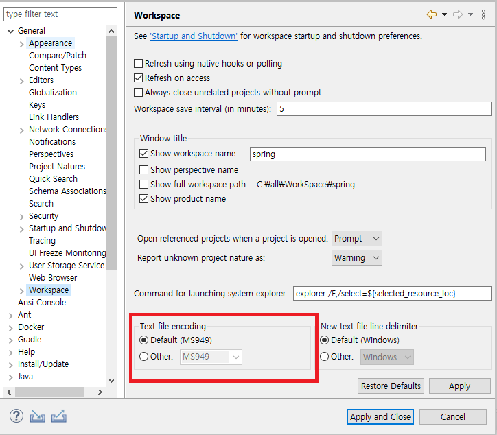

General -> Workspace 후

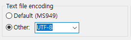

Text file Encoding 칸에 other을 눌러 UTF-8 로 설정한다.

나머지는 인터넷에 찾아봐도 설정창을 찾아볼 수 없었다. 프로젝트를 진행하며 이상이 생긴다면 원인 분석에 들어가봐야겠다.

