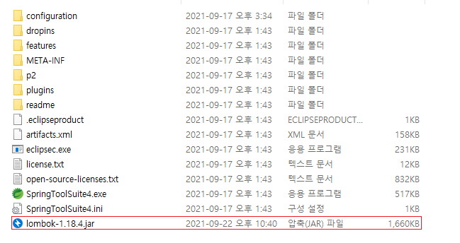
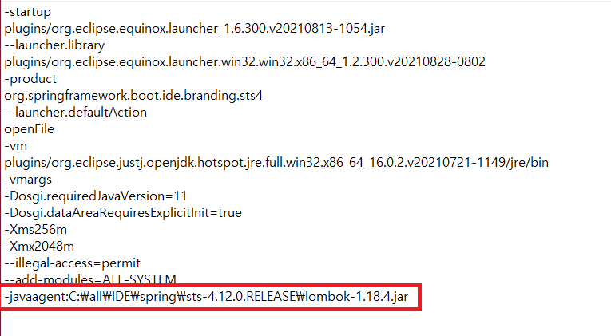
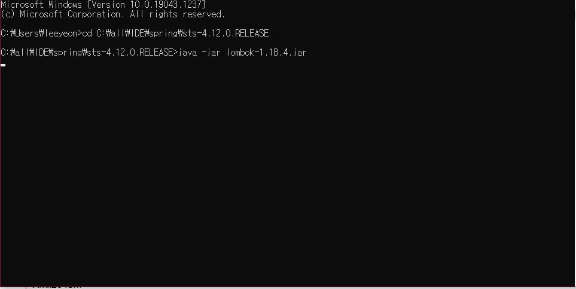
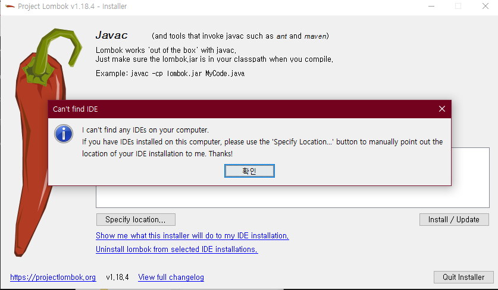
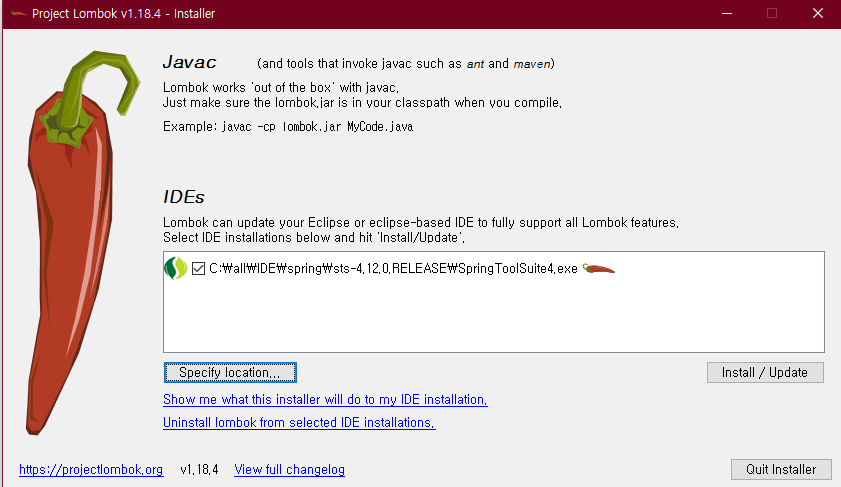
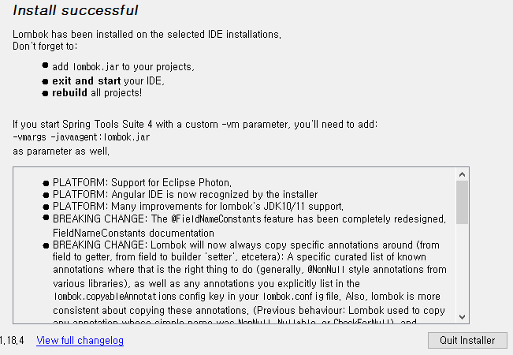
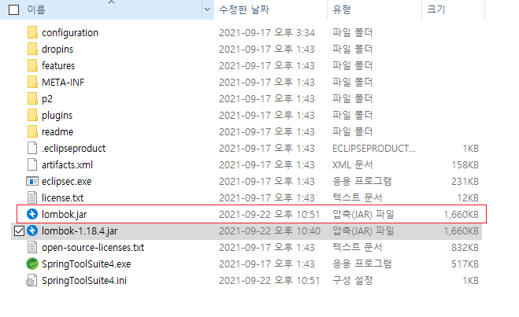

# Chapter03 : 롬 북 ( Lombok )

### 롬북을 쓰는 이유

모델 Class(VO, DTO, Entity)를 만들 때 생성자, 접근자, 설정자, toString() 등 매번 만들어야 한다

lombok을 사용하면 @Getter, @Setter 같은 어노테이션만 붙이면 자동으로 해줘 편하고 좋기 때문에 사용한다고 한다.

#### 여기서 작은 의문점.

이클립스에서도 Getter Setter을 만들어 줄 수 있는 걸로 알고 있는데 단순히 클래스안에서  @Getter, @Setter을 선언을 하면 만들어

진다는 뜻인가? 

### 롬북 설치

SpringToolSuite4 IDE 폴더 안에 lombok을 복사하고

SpringToolSuite4.ini 에 경로정보만 추가

command 를 이용하여 lombok.jar 파일 실행

### 오류

이런 의미를 가진 오류 무슨 뜻인지는 알았지만 내 머리를 의심하여 한번더 번역기를 돌려 보았다.

일단 Spring Tool 경로를 지정을 해주고 인스톨을 눌러보겠다.

설치가 완료되었다고 한다.

설치가 잘 되었는지 확인 lombok.jar 파일만 있다면 설치가 완료된 것이다.

